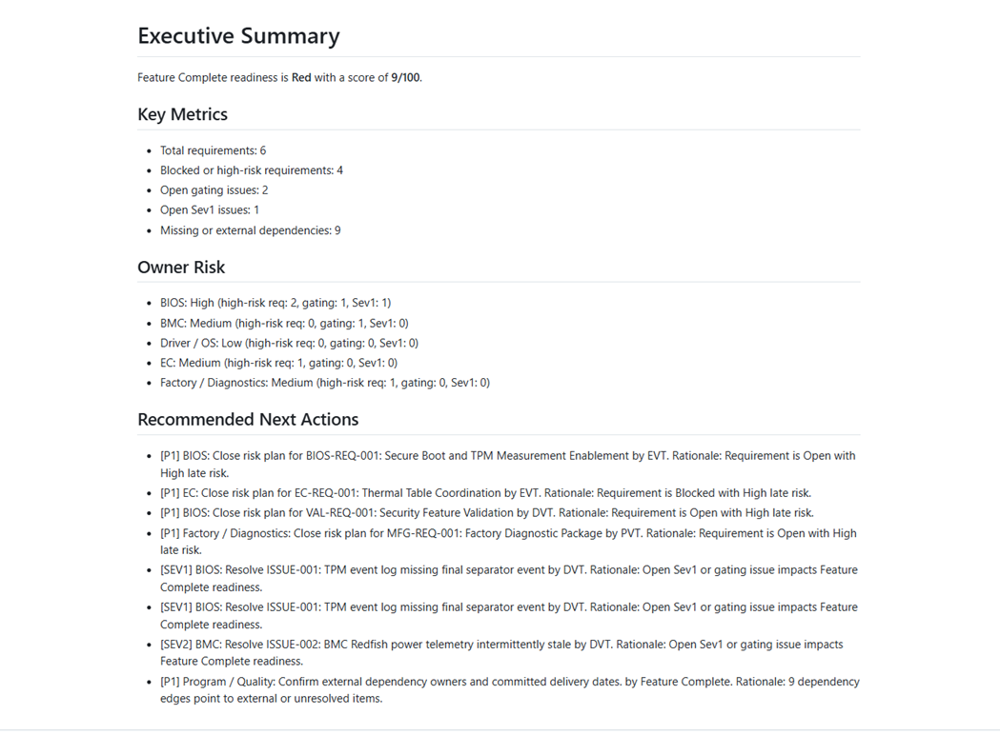
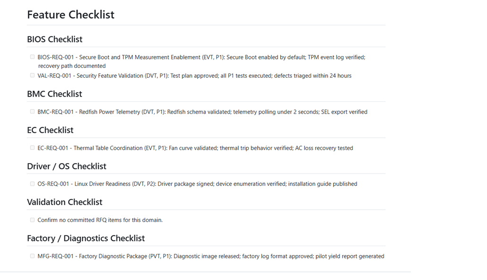
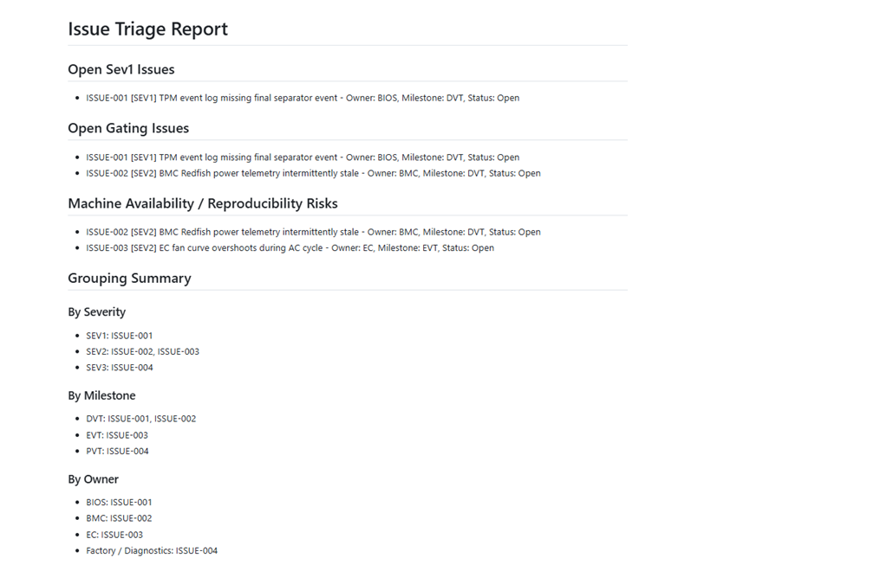
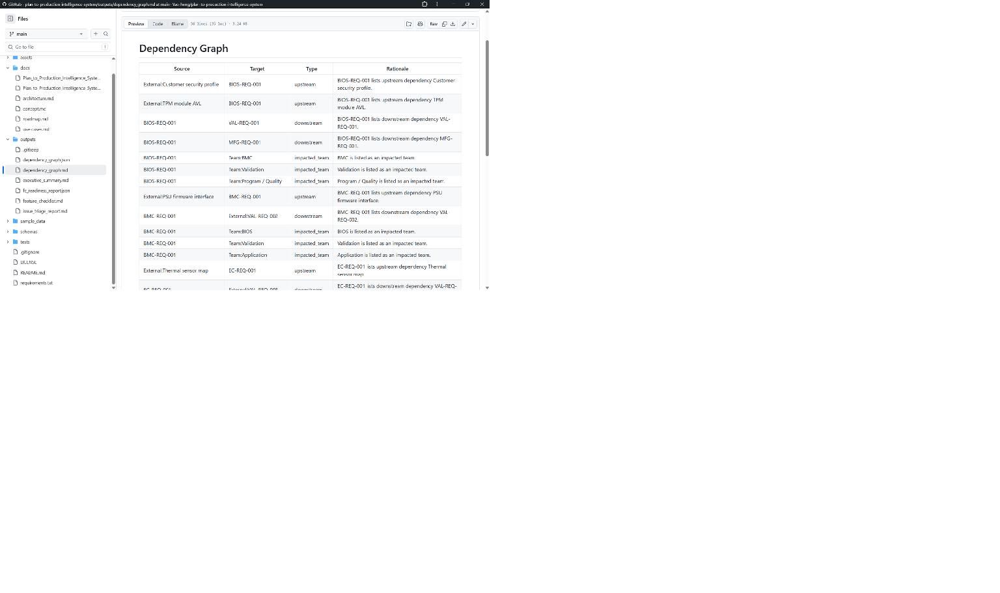

# plan-to-production-intelligence-system
An AI-driven intelligent management system that transforms fragmented requirements, cross-functional dependencies, validation issues, release risks, and production readiness signals into executable ownership, readiness intelligence, recovery plans, and production decision support.

The Plan-to-Production Intelligence System is designed for enterprises that want real process transformation from AI adoption: reduced meeting time, lower human coordination loading, better resource utilization, more controlled product quality, predictable schedules, improved production readiness, and higher production line utilization.

This project productizes senior platform delivery intelligence learned from complex hardware, firmware, software, validation, ODM/JDM, manufacturing, and sustaining environments.


**AI-driven platform delivery governance from requirements to release readiness.**
## Project Documents

This project is documented as both a formal concept paper and a pitch deck.

* [Download Concept Document](docs/Plan_to_Production_Intelligence_System_Concept_v2.docx)
* [Download Pitch Deck](docs/Plan_to_Production_Intelligence_System_Pitch_v2.pptx)

The concept document explains the full Plan-to-Production Intelligence System, including enterprise pain points, AI-driven process transformation, agentic loop design, requirement decomposition, ownership routing, dependency intelligence, validation issue convergence, production readiness, and sustaining handoff.

The pitch deck provides a concise executive-level overview for recruiters, hiring managers, product leaders, and engineering leaders.

## Portfolio Positioning

This project is not a generic chatbot or task tracker. It is a domain-driven AI system concept and MVP prototype focused on enterprise delivery governance.

Many companies want AI adoption that creates measurable operational improvement, not only text generation. This system targets the areas enterprises care about most:

* Reducing repetitive coordination meetings
* Lowering human loading across engineering, validation, quality, manufacturing, and program teams
* Improving ownership clarity and accountability
* Detecting cross-functional dependencies earlier
* Improving product quality and release readiness
* Making schedules more predictable
* Reducing late production surprises
* Improving production line utilization
* Helping leaders make faster go / no-go decisions with structured evidence

The core idea is to convert the experience of senior technical program leaders, platform delivery owners, SWDMs, STMs, LDs, and cross-functional engineering leaders into an AI-assisted Plan-to-Production governance system.


## Why enterprises need this now

Enterprises do not only need another PM dashboard. They need a process-level operating model that reduces repetitive meetings, lowers engineering coordination load, makes product quality and schedules more controllable, and improves production-line utilization by detecting blockers before build capacity is wasted.

## Core product thesis

Plan-to-Production Intelligence System converts fragmented requirements, engineering dependencies, validation issues, and release risks into executable ownership, readiness intelligence, recovery plans, and production decision support.

## Target business outcomes

- **Reduce meeting time:** AI-generated agendas, owner actions, readiness gaps, and decision summaries replace repetitive status collection.
- **Reduce manpower loading:** Automate requirement extraction, checklist creation, owner routing, duplicate issue detection, and executive reporting.
- **Improve product quality and schedule control:** Evidence-based FC, pilot, production, RFD/RTS, and sustain handoff readiness gates make risks visible earlier.
- **Increase production-line utilization:** Detect blockers before build exit, reduce late surprises, and align recovery plans before line capacity is wasted.
- **Scale process intelligence across industries:** Apply the same requirement-to-release governance pattern to AI servers, storage systems, automotive, medical devices, semiconductor validation, aerospace, and enterprise software.

## Agentic workflow

Observe → Reason → Act → Verify → Escalate → Learn

The system productizes senior SWDM / STM / LD execution logic into an AI-assisted governance loop, while keeping human approval gates for production, release, customer risk, and commercial trade-off decisions.

## Modules

1. RFQ Package Ingestion Agent
2. Requirement Extraction Agent
3. Function Ownership Router
4. Feature Checklist Generator
5. Dependency Graph Agent
6. FC Readiness Agent
7. Issue Triage Agent
8. Recovery Plan Agent
9. Sustain Handoff Agent
10. Executive Risk Report Agent

## MVP roadmap

- MVP 1: RFQ document ingestion and requirement extraction
- MVP 2: Function checklist generation and owner routing
- MVP 3: Dependency graph and FC readiness dashboard
- MVP 4: Issue triage and recovery recommendation
- MVP 5: Executive risk report and GitHub demo dataset

## MVP Prototype

This repository now includes a local MVP prototype that demonstrates the core Plan-to-Production Intelligence System workflow.

The MVP uses fictional sample data to simulate an AI server platform program and demonstrates how fragmented RFQ requirements, validation issues, ownership signals, dependencies, and milestone risks can be transformed into structured delivery intelligence.

### MVP Workflow

The current prototype performs the following steps:

1. Loads a fictional RFQ package from `sample_data/sample_rfq_package.md`
2. Extracts structured platform requirements
3. Routes requirements to functional owner teams
4. Detects cross-team dependencies
5. Generates function-level feature checklists
6. Loads sample validation issues from `sample_data/sample_issues.json`
7. Performs issue triage by severity, owner, milestone, and gating status
8. Generates Feature Complete readiness assessment
9. Produces executive-level summary reports

### How to Run

```bash
pip install -r requirements.txt
python app/main.py
pytest
```

### Generated Outputs

After running the MVP, the system generates output artifacts under the `outputs/` folder:

* `outputs/feature_checklist.md`
* `outputs/dependency_graph.json`
* `outputs/dependency_graph.md`
* `outputs/issue_triage_report.md`
* `outputs/fc_readiness_report.json`
* `outputs/executive_summary.md`
* 
### Demo Output

The following generated outputs demonstrate the MVP workflow results:

* [Executive Summary](outputs/executive_summary.md)
  Shows the overall Feature Complete readiness status, major risks, gating issues, owner risks, and recommended next actions.

* [Feature Checklist](outputs/feature_checklist.md)
  Shows how fragmented RFQ requirements are converted into function-level execution checklists across BIOS, BMC, EC, Driver / OS, Validation, Factory, and Program teams.

* [Issue Triage Report](outputs/issue_triage_report.md)
  Shows how validation issues are grouped by severity, gating status, owner, milestone impact, reproducibility, and machine availability.

* [Dependency Graph](outputs/dependency_graph.md)
  Shows cross-functional upstream and downstream dependencies that may impact Feature Complete, Pilot, Production Readiness, RFD, RTS, or Sustaining Handoff.

* [Readiness Report JSON](outputs/fc_readiness_report.json)
  Provides structured readiness data that can be consumed by dashboards, APIs, or future AI agents.

  ## Visual Demo

The MVP generates structured delivery intelligence from fictional RFQ, schedule, and issue data. The screenshots below show how fragmented project information is converted into executive summaries, function-level checklists, issue triage reports, and dependency intelligence.

### Executive Summary



The executive summary provides a decision-ready view of Feature Complete readiness, gating issues, owner risks, schedule risks, and recommended next actions.

### Feature Checklist



The feature checklist demonstrates how fragmented RFQ requirements are converted into function-level execution ownership across BIOS, BMC, EC, Driver / OS, Validation, Factory, and Program teams.

### Issue Triage Report



The issue triage report groups validation issues by severity, gating status, owner, milestone impact, reproducibility, and machine availability.

### Dependency Graph



The dependency graph shows upstream and downstream relationships that may affect Feature Complete, Pilot, Production Readiness, RFD, RTS, or Sustaining Handoff.


### Why These Outputs Matter

These outputs demonstrate how the system converts scattered project data into decision-ready delivery intelligence.

Instead of relying on repeated status meetings, manual spreadsheet tracking, and fragmented ownership discussions, the MVP shows how AI-assisted governance can generate structured checklists, owner visibility, dependency intelligence, issue triage, readiness scoring, and executive summaries.

This is the foundation for reducing meeting time, lowering human coordination load, improving product quality, controlling schedule risk, and improving production readiness.


### What This Demonstrates

This MVP demonstrates the first step toward an AI-driven Plan-to-Production governance system.

It shows how enterprises can reduce manual coordination effort, meeting preparation time, ownership ambiguity, issue tracking overhead, and release readiness uncertainty by converting fragmented project information into structured, decision-ready intelligence.

The current implementation is deterministic and does not require external APIs or API keys. Future versions can extend this foundation with LLM-based extraction, RAG, Jira integration, PLM integration, validation log ingestion, CI/CD data, and production readiness dashboards.
